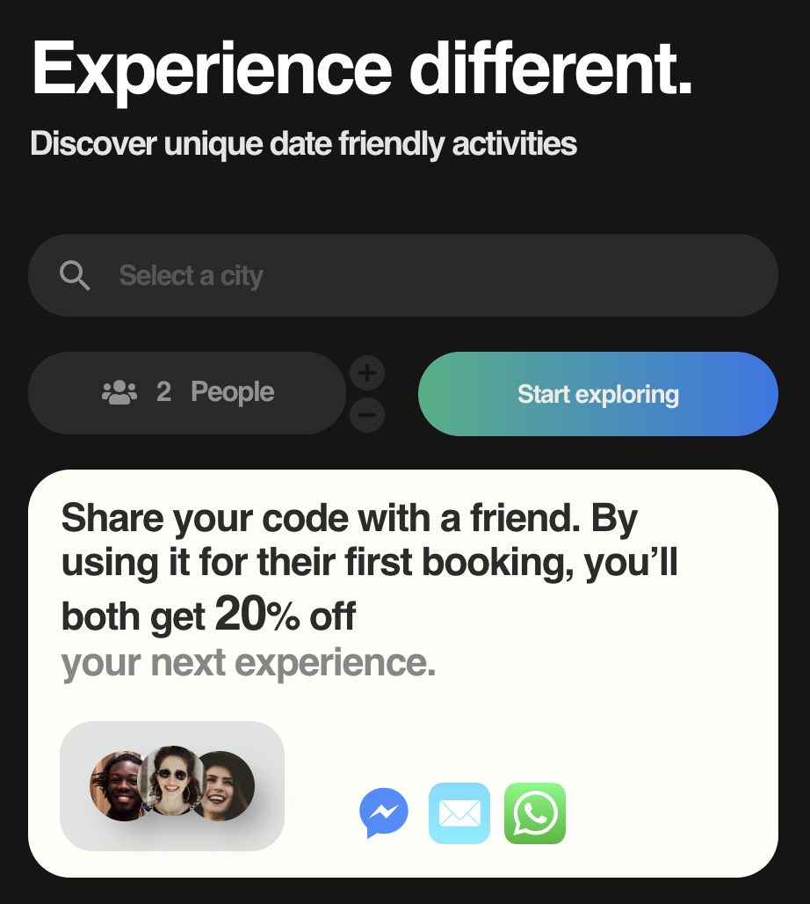
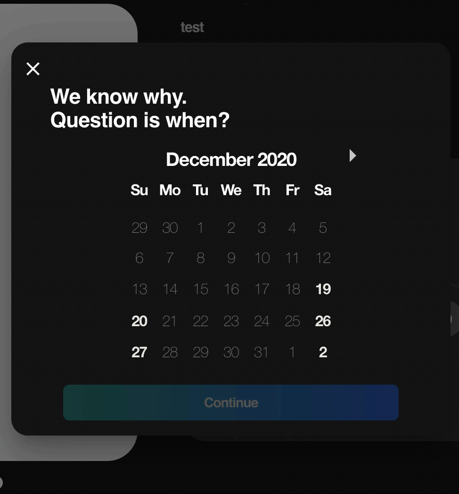
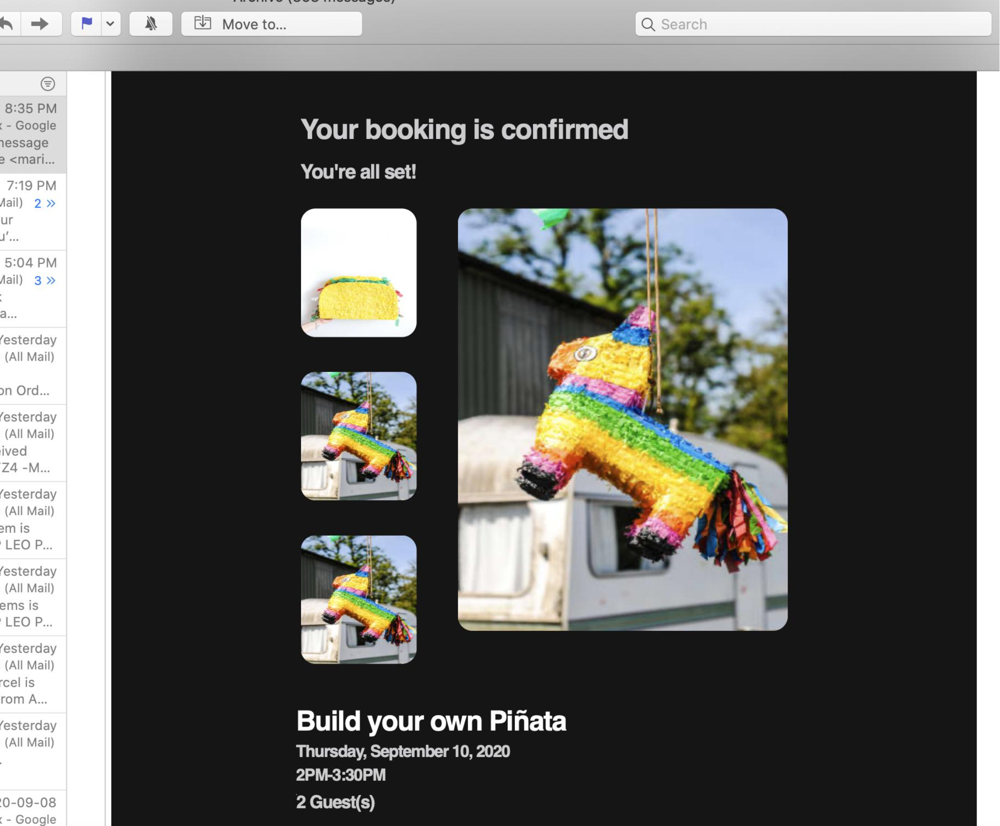

# Ramble
Essentially, [Ramble](https://www.experienceramble.com/) is an activity marketplace which connects anyone who has a cool interest to share with people who want to experience something different. 

## Built with
* *MERN* (MongoDB, Express, React and NodeJS) stack.
* [Material-UI](https://material-ui.com/) was used for the base React components, but several modifications to the styling were made.

* [Stripe](https://stripe.com/en-ca) for payment management.

* SocketIO for live notification updates.
* User authentication with Facebook, Google and email.
* Image processing and storage with Cloudinary.
* Email updates, with personalized templates created with [MJML](https://mjml.io/).

## Author
* [Maria Solano](https://mariasolos.github.io/me/) 

## License
[MIT Licence](https://github.com/angular/angular.js/blob/master/LICENSE)
